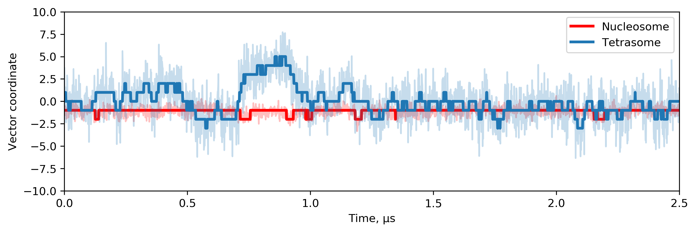
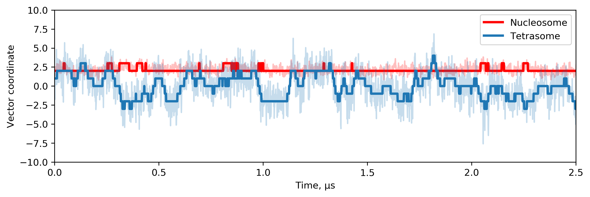
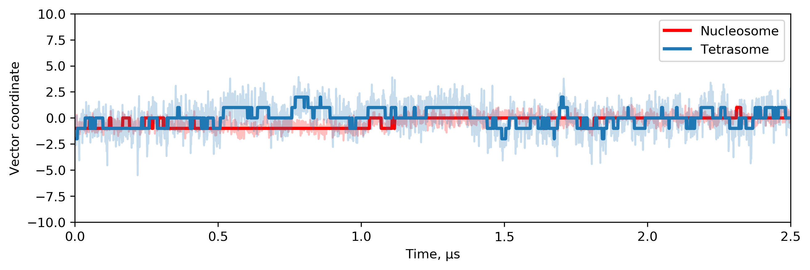

### Characteristic modes of tetrsome molecular dynamics 

Modes were extracted from tetrasome MD trajectory (TETR124, 2) using Principal component analysis of covarience matrix for CA-atoms of histone tetramer globular part (without flexible tails). PCA was performed via Gromacs 2020.1 program. 
This page presents first 3 tetrasome characteristic modes. Each mode was described with interpolation between the two extreme projections along a trajectory on the average structure and projection profile of a tetrasome (blue) and nucleosome (red) trajectories on this mode. 

[Back](http://intbio.github.io/Shi_et_al_2024/)

<html lang="en">
<head>
  <meta charset="utf-8">
</head>
<body>
  
H3
 
  
H4

 <h3> Mode 1</h3>
  Pac-man-like tetramer movement (opening); describes 29% of trajectory variance. 
  
  
  

</body>
</html>

### Tetrasome trajectory projection on the 1st mode 

<html lang="en">
<head>
  <meta charset="utf-8">
</head>
<body>
  <h3> Mode 2</h3>
  Torsion tetramer movement; describes 26% of trajectory variance. 
  
  

 
 
</body>
</html>

### Tetrasome trajectory projection on the 2nd mode 

  
  
<html lang="en">
<head>
  <meta charset="utf-8">
</head>
<body>
  <h3> Mode 3</h3>
  This mode escribes 10% of trajectory variance. 
  
  

</body>
</html>

### Tetrasome trajectory projection on the 3rd mode 

